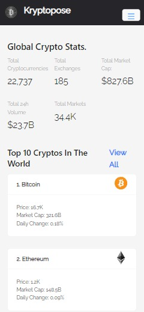

# Kryptopose-React

A React crypto info and news app to showcase API integration using redux, UI designing using ant design and general best practices for using React.
## Give it a start if you like it.
below are some screenshots:

<table>
<tr>
  <th>HomePage[Desktop]</th>
  <th>HomePage[Mobile]</th>
 </tr>
  <tr>
    <td> </td>
    <td></td>
  </tr>
  <tr>
    <th>Cryptocurrencies[Desktop]</th>
    <th>Cryptocurrencies[Mobile]</th>
  <tr>
    <td> </td>
    <td></td>
  </tr>
  <tr>
    <th>CryptoDetails[Desktop]</th>
    <th>CryptoDetails[Mobile]</th>
  <tr>
    <td> </td>
    <td></td>
  </tr>
  <tr>
    <th>CryptoNews[Desktop]</th>
    <th>CryptoNews[Mobile]</th>
  <tr>
    <td> </td>
    <td></td>
  </tr>
</table>

Visit live site @[kryptopose.netlify.app](https://kryptopose.netlify.app/) 
